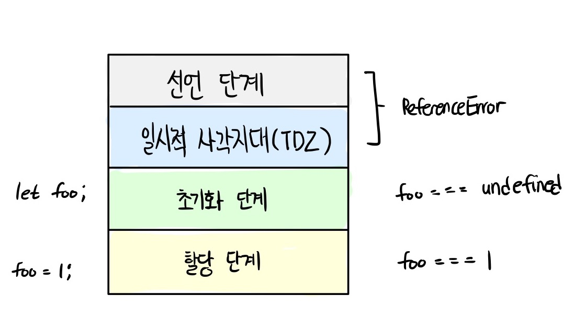

## 목차

- [자바스크립트란 🔥](#자바스크립트란)
    - 자바스크립트의 특징은 뭐가 있나요?
    
- [변수 🔥](#변수)
  - 변수란 무엇인가요?
  - 식별자란 무엇인가요? 🔥
  - 변수를 선언한다는 것은 어떤 것을 의미하나요?
  - var 키워드는 뭔가요?
  - 호이스팅이 뭔가요? 🔥🔥
  - var 키워드의 문제점은 무엇이 있나요? 🔥
  - let 키워드는 var 키워드와 어떤 점이 다른가요? 🔥🔥
  - TDZ 🔥🔥
  - const 키워드는 어떤 특징이 있나요? 🔥
  - 식별자 네이밍 규칙은 어떤 것들이 있나요?
  - 네이밍 컨벤션은 어떤 것들이 있나요?
    - 리터럴이 뭔가요?

- [요약](#요약)

## 자바스크립트란

### 자바스크립트의 특징은 뭐가 있나요?
자바스크립트는 HTML, CSS와 함께 웹을 구성하는 요소 중 하나로 웹 브라우저에서 동작하는 유일한 프로그래밍 언어다.

자바스크립트는 개발자가 별도의 컴파일 작업을 수행하지 않는 **인터프리터 언어이다.** **인터프리터는 소스코드를 즉시 실행하고** **컴파일러는 빠르게 동작하는 머신 코드를 생성하고 최적화한다.** 이를 통해 컴파일 단계에서 추가적인 시간이 필요함에도 더욱 빠르게 코드를 실행할 수 있다.

자바스크립트는 **런타임에 컴파일되며 실행 파일이 생성되지 않고 인터프리터의 도움 없이 실행할 수 없기 때문에 컴파일러 언어라고 할 수는 없다.**

## 변수

### 변수란 무엇인가요?
변수는 하나의 값을 저장하기 위해 확보한 메모리 공간 자체 또는 그 메모리 공간을 식별하기 위해 붙인 이름을 말한다.

### 식별자는 무엇인가요?
변수의 이름을 식별자(identifier)라고도 한다. 식별자는 어떤 값을 구별해서 식별할 수 있는 고유한 이름을 말한다. **식별자는 값이 아니라 메모리 주소를 기억하고 있다.**

또한 식별자라는 용어는 변수 이름에만 국한해서 사용하지 않는다. 예를 들어, 변수, 함수, 클래스 등의 이름은 모두 식별자다. 식별자인 변수 이름으로는 메모리 상에 존재하는 변수 값을 식별할 수 있고, 함수 이름으로는 메모리 상에 존재하는 함수를 식별할 수 있다. **즉, 메모리 상에 존재하는 어떤 값을 식별할 수 있는 이름은 모두 식별자라고 부른다.**

### 변수를 선언한다는 것은 어떤 것을 의미하나요?

```js
var score;
```

변수 선언이란 **변수를 생성하는 것**을 말한다. 좀 더 자세히 말하면 **값을 저장하기 위한 메모리 공간을 확보하고 변수 이름과 확보된 메모리 공간의 주소를 연결해서 값을 저장할 수 있게 준비하는 것이다.** 변수를 사용하려면 반드시 선언이 필요하다. <br>
변수를 선언할 때는 var, let, const 키워드를 사용한다.

### var 키워드는 뭔가요?
```js
var score;
// undefinded
```
var 키워드는 뒤에 오는 변수 이름을 새로운 변수를 선언할 것을 지시하는 키워드이다. 키워드는 자바스크립트 코드를 해석하고 실행하는 자바스크립트 엔진이 수행할 동작을 규정한 일종의 명령어이다. 자바스크립트 엔진은 키워드를 만나면 자신이 수행해야 할 약속된 동작을 수행한다. 예를 들어, var 키워드를 만나면 자바스크립트 엔진은 뒤에 오는 변수 이름으로 새로운 변수를 선언한다.

변수를 선언한 이후, 아직 변수에 값을 할당하지 않았다. 따라서 변수 선언에 의해 확보된 메모리 공간은 비어 있을 것으로 생각할 수 있으나 확보된 메모리 공간에는 자바스크립트 엔진에 의해 undefined라는 값이 암묵적으로 할당되어 초기화된다. 이것이 자바스크립트의 독특한 특징이다.

### 호이스팅이 뭔가요?
```js
console.log(score); // undefined;

var score; // 변수 선언문
```
js 엔진은 변수 선언(을 포함한 모든 선언문)이 소스코드의 어디에 있든 상관없이 다른 코드보다 먼저 실행한다. 런타임 이전에 실행 컨텍스트에 의해 소스코드 평가 과정에서 스코프에 등록되고 이를 마치 코드의 제일 위에 있는 것처럼 변수가 어디에 위치하던지와 상관없이 어디서든지 변수를 참조할 수 있는 것처럼 만드는 특징을 변수 호이스팅이라고 합니다.

**사실 변수 선언뿐 아니라 var, let, const, function, function\*, class 키워드를 사용해서 선언하는 모든 식별자(변수, 함수, 클래스 등)는 호이스팅된다. 모든 선언문은 런타임 이전 단계에서 먼저 실행되기 때문이다.**

### var 키워드의 문제점은 무엇이 있나요?
var 키워드로 선언된 변수는 다음과 같은 특징이 있다.

1. 변수 중복 선언 허용
2. 함수 레벨 스코프
3. 변수 호이스팅

<b>1. 변수 중복 선언 허용</b><br>

var 키워드로 선언된 변수는 같은 스코프 내에서 중복 선언이 허용되는데, 이는 의도치 않게 변수값이 재할당되어 변경되는 부작용을 발생시킨다.

```js
function foo() {
  var x = 1;
  // var 키워드로 선언된 변수는 같은 스코프 내에서 중복 선언을 허용한다.
  // 아래 변수 선언문은 자바스크립트 엔진에 의해 var 키워드가 없는 것처럼 동작한다.
  var x = 2;
  console.log(x); // 2
}
foo();
```
<b>2. 함수 레벨 스코프</b><br>
대부분의 프로그래밍 언어는 함수 몸체만이 아니라 모든 코드 블록(if, for, while, try/catch 등)이 지역 스코프를 만든다. 이러한 특성을 **블록 레벨 스코프**라 한다. 하지만 var 키워드로 선언된 변수는 오로지 함수의 코드 블록(함수 몸체)만을 지역 스코프로 인정한다. 이러한 특성을 **함수 레벨 스코프**라 한다.

```js
case 1 : var 키워드로 변수 선언

var x = 1;

if (true) {
  // var 키워드로 선언된 변수는 함수의 코드 블록(함수 몸체)만을 지역 스코프로 인정한다.
  // 함수 밖에서 var 키워드로 선언된 변수는 코드 블록 내에서 선언되었다 할지라도 모두 전역 변수다.
  // 따라서 x는 전역 변수다. 이미 선언된 전역 변수 x가 있으므로 x 변수는 중복 선언된다.
  // 이는 의도치 않게 변수 값이 변경되는 부작용을 발생시킨다.
  var x = 10;
}
console.log(x); // 10

case 2 : var 키워드로 for문 안의 변수 선언

var i = 10;

// for 문에서 선언한 i는 전역 변수다. 이미 선언된 전역 변수 i가 있으므로 중복 선언된다.
for (var i = 0; i < 5; i++) {
  console.log(i); // 0 1 2 3 4
}

// 의도치 않게 변수의 값이 변경되었다.
console.log(i); // 5
```

<b>3. 변수 호이스팅</b><br>
var 키워드로 선언된 변수는 선언과 동시에 undefined로 초기화되며, 런타임 즉 소스코드 평가 단계에서 스코프에 등록되기 때문에 실행 단계에서 실제 값이 할당되지 않더라도 undefined를 가지고있다. 이를 변수 호이스팅이라 한다.

```js
console.log(score); // undefined;

var score; // 변수 선언문
```

### let 키워드는 var 키워드와 어떤 점이 다른가요?
let 키워드는 var 키워드의 단점을 보완하기 위해 ES6에서 도입된 새로운 키워드입니다.

```
1. 변수 중복 선언 금지
2. 블록 레벨 스코프
3. 변수 호이스팅
4. 전역 객체와 let
```
<b>1. 변수 중복 선언 금지</b><br>
var 키워드로 이름이 동일한 변수를 중복 선언하면 아무런 에러가 발생하지 않는다. 이때 변수를 중복 선언하면서 값까지 할당했다면 의도치 않게 먼저 선언된 변수 값이 재할당되어 변경되는 부작용이 발생한다. 하지만 let 키워드로 이름이 같은 변수를 중복 선언하면 문법 에러(SyntaxError)가 발생한다.
```js
let bar = 123;
// let이나 const 키워드로 선언된 변수는 같은 스코프 내에서 중복 선언을 허용하지 않는다.
let bar = 456; // SyntaxError: Identifier 'bar' has already been declared
```

<b>2. 블록 레벨 스코프</b><br>
let 키워드를 통해 선언된 변수는 블록 레벨 스코프를 따른다. 함수 뿐만 아니라 모든 코드 블록 내에 선언된 변수(지역 변수)는 해당 유효 범위(스코프)를 벗어나면 사용할 수 없다.
```js
let foo = 1; // 전역 변수

{
  let foo = 2; // 지역 변수
  let bar = 3; // 지역 변수
}

console.log(foo); // 1
console.log(bar); // ReferenceError: bar is not defined
```

<b>3. 변수 호이스팅</b><br>

var 키워드로 선언한 변수와 달리 let 키워드로 선언한 변수는 변수 호이스팅이 발생하지 않는 것처럼 동작한다.

```js
console.log(foo); // Cannot access 'foo' before initialization
let foo;
```

var 키워드였다면 변수 호이스팅에 의해 런타임 이전에 변수가 선언되어 undefined를 출력해야 한다. 하지만 let 키워드에서는 참조에러가 나타난다.

let 키워드로 선언한 변수는 '선언 단계'와 '초기화 단계'가 분리되어 진행된다. 즉, 런타임 이전에 자바스크립트 엔진에 의해 암묵적으로 선언 단계가 먼저 실행되지만 초기화 단계는 변수 선언문에 도달했을 때 실행된다. 만약 초기화 단계가 실행되기 이전에 변수에 접근하려고 하면 참조 에러가 발생한다.

let 키워드로 선언한 변수는 스코프의 시작 지점부터 초기화 단계 시작 지점(변수 선언문)까지 변수를 참조할 수 없다. 스코프의 시작 지점부터 초기화 시작 지점까지 변수를 참조할 수 없는 구간을 **일시적 사각지대(TDZ: Temporal Dead Zone)** 라 부른다.



```js
// 런타임 이전에 선언 단계가 실행된다. 아직 변수가 초기화되지 않았다.
// 초기화 이전의 일시적 사각 지대에서는 변수를 참조할 수 없다.
console.log(foo); // ReferenceError: foo is not defined

let foo; // 변수 선언문에서 초기화 단계가 실행된다.
console.log(foo); // undefined

foo = 1; // 할당문에서 할당 단계가 실행된다.
console.log(foo); // 1
```

<b>4. 전역 객체와 let</b><br>

let 키워드로 선언한 전역 변수는 전역 객체의 프로퍼티가 아니다. 즉, window.foo와 같이 접근할 수 없다.

```js
let x = 1;

// let, const 키워드로 선언한 전역 변수는 전역 객체 window의 프로퍼티가 아니다.
console.log(window.x); // undefined
console.log(x); // 1
```

### const 키워드는 어떤 특징이 있나요?
const 키워드는 상수(constant)를 선언하기 위해 사용하지만, 반드시 상수만을 위해 사용하지는 않는다. const 키워드의 특징은 let과 대부분 동일하므로 let 키워드와 다른 점을 중심으로 살펴볼 필요가 있다.

```
1. 선언과 초기화
2. 재할당 금지
3. 상수
```

<b>1. 선언과 초기화</b><br>

const 키워드로 선언한 변수는 반드시 선언과 동시에 초기화해야 한다. 그렇지 않을 경우 문법 에러(SyntaxError)가 발생한다.

```js
const bar = 1;
console.log(bar); 
// 1

const foo;
console.log(foo); 
// SyntaxError: Missing initializer in const declaration
```

<b>2. 재할당 금지</b>

var 또는 let 키워드로 선언한 변수는 재할당이 자유로우나 const 키워드로 선언한 변수는 재할당이 금지된다.

```js
const foo = 1;
foo = 2; // TypeError: Assignment to constant variable.
```
<b>3. 상수</b><br>

const 키워드로 선언한 변수에 원시 값을 할당한 경우 변수 값을 변경할 수 없다. 원시 값은 변경 불가능한 값이므로 재할당 없이 값을 변경할 수 있는 방법이 없기 때문이다. 이러한 특징을 이용해 const 키워드를 상수를 표현하는 데 사용하기도 한다.

```js
// 세율을 의미하는 0.1은 변경할 수 없는 상수로서 사용될 값이다.
// 변수 이름을 대문자로 선언해 상수임을 명확히 나타낸다.
const TAX_RATE = 0.1;

// 세전 가격
let preTaxPrice = 100;

// 세후 가격
let afterTaxPrice = preTaxPrice + preTaxPrice * TAX_RATE;

console.log(afterTaxPrice); // 110
```

### 한 줄 요약

|           var 키워드           | let 키워드  |     const 키워드     |
| :----------------------------: | :---------: | :------------------: |
| 선언 및 초기화 단계(undefined) |  선언 단계  | 선언 + 초기화 + 할당 |
|           할당 단계            | 초기화 단계 |                      |
|               -                |  할당 단계  |                      |

### 식별자 네이밍 규칙은 어떤 것들이 있나요?

식별자는 특수문자를 제외한 문자, 숫자, 언더스코어(\_), 달러 기호($)를 포함할 수 있다.

단 식별자는 특수문자를 제외한 문자, 언더스코어(\_), 달러 기호로 시작해야 한다. 숫자로 시작하는 것은 허용하지 않는다.

<br/>

### 네이밍 컨벤션은 어떤 것들이 있나요?

```js
// 카멜 케이스 (camelCase)
var firstName;

// 스네이크 케이스 (snake_case)
var first_name;

// 파스칼 케이스 (PascalCase)
var FirstName;

// 헝가리언 케이스 (typeHungarianCase)
var strFirstName; // type + identifier
var $elem = document.getElementById("myId"); // DOM 노드
var observable$ = fromEvent(document, "click"); // RxJS 옵저버블
```

### 네이밍 규칙
Boolean (true,false) 형태일 경우<br>
  관련 글: https://soojin.ro/blog/naming-boolean-variables
  ```
  1. is 용법
  2. 조동사 용법
  3. has 용법
  4. 동사원형 용법
  ```

### 리터럴이 뭔가요?

리터럴(literal)은 사람이 이해할 수 있는 문자 또는 약속된 기호를 사용해 값을 생성하는 표기법(=notation) 을 말합니다.

```
<!-- 숫자 리터럴 3 -->
3
```

위 예제의 3은 단순한 아라비아 숫자가 아니라 숫자 리터럴이다. 사람이 이해할 수 있는 아라비아 숫자를 사용해 숫자 리터럴 3을 코드에 기술하면 자바스크립트 엔진은 이를 평가해 숫자 값 3을 생성한다. 자바스크립트 엔진은 코드가 실행되는 시점인 런타임에 리터럴을 평가해 값을 생성한다.

## 요약
#### 자바스크립트 특징
  - 웹 브라우저에서 동작하는 유일한 프로그래밍 언어
  - 인터프리터 언어
### 변수
#### 호이스팅
  - 선언문이 소스코드 어디에 있든 다른 코드보다 먼저 실행<br>
    => 모든 선언문은 실행 컨텍스트에 의해 런타임 이전 단계에 먼저 실행되기 때문
#### 변수 키워드
  - var
  - let
  - const
#### var 키워드
  - 새로운 변수를 선언하도록 지시하는 명령어(키워드)
  - 변수 값을 할당하지 않은 경우 undefined 값으로 초기화 할당<br>
    => 자바스크립트의 특징
#### var 키워드 문제점
  1. 변수 중복 선언 허용<br>
    => 의도치 않게 변수값이 재할당되어 변경되는 부작용을 발생
  2. 함수 레벨 스코프<br>
    => 오로지 함수의 코드 블록(함수 몸체)만을 지역 스코프로 인정<br>
      => 코드 블록(if, for, while, try/catch 등) 제외
  3. 변수 호이스팅<br>
    => var 키워드로 선언된 변수는 선언과 동시에 undefined로 초기화
#### let 키워드
  1. 변수 중복 선언 금지<br>
    => 중복 선언하면 문법 에러(SyntaxError) 발생
  2. 블록 레벨 스코프<br>
    => 함수 포함 모든 코드 블록 내에 선언된 변수는 해당 범위(스코프)를 벗어나면 사용할 수 없음
  3. 변수 호이스팅<br>
    => 일시적 사각지대(TDZ)로 인해 발생하지 않는 것 처럼 동작
    => ReferenceError: foo is not defined 에러 발생 
  4. 전역 객체와 let<br>
    => let, const 키워드로 선언한 전역 변수는 전역 객체 window의 프로퍼티가 아님
    => window.변수 로 접근 불가
#### const 키워드
  1. 선언과 초기화<br>
    => 반드시 선언과 동시에 초기화
  2. 재할당 금지<br>
  3. 상수<br>
    => 상수로 표현할 경우 변수명은 대문자로 표기

|           var 키워드           | let 키워드  |     const 키워드     |
| :----------------------------: | :---------: | :------------------: |
| 선언 및 초기화 단계(undefined) |  선언 단계  | 선언 + 초기화 + 할당 |
|           할당 단계            | 초기화 단계 |                      |
|               -                |  할당 단계  |                      |